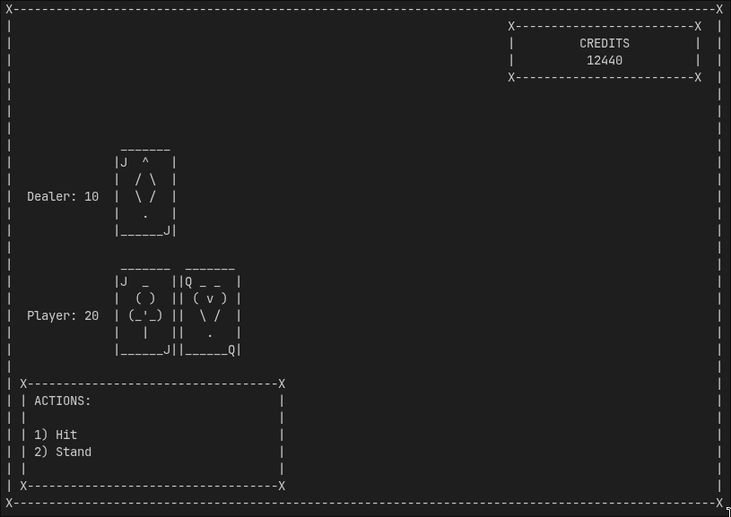
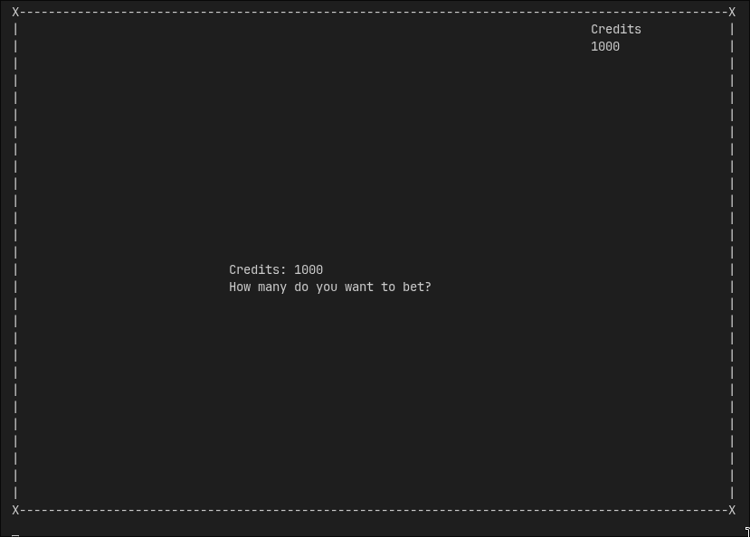
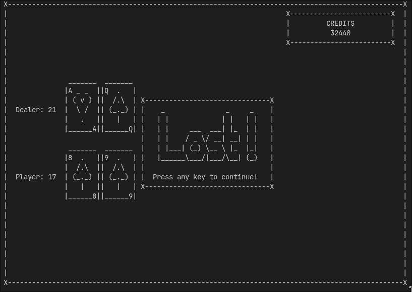

# Simple Blackjack

Simple Blackjack is a project I made for the backend developer course on [boot.dev](https://boot.dev)

It is as the name suggests a very simple implementation of Blackjack running in the terminal with an ASCII artstyle. It allows the following actions:
- Betting
- Getting Cards
- Standing down

To run it just clone the repo and run `python3 src/main.py`

The program expects simple terminal input in numeric form.

Text from [here](https://patorjk.com/software/taag/#p=display&f=Graffiti&t=Type+Something+&x=none&v=4&h=4&w=80&we=false)
Graphics from [here](https://www.asciiart.eu/miscellaneous/playing-cards)